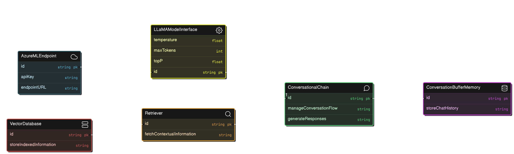

# Conversational RAG project with AzureML

In this project we will do a project where we wwill use a serverless model hosted in Azure model endpoints. Then here we will create a RAG based model workflow where the model will retrieve the vectors stored in local vector database FAISS the Facebook AI Similarity Search and generate the answer to our queries where the model will keep the indexed document and chat history in memory.

## Why does Memory matter?

These LLM models though having great power lack the great responsibility🕸️🕷️ as they are stateless unaware of the initial statements they have produced so, when you will ask another question related to the prior questions it will halucinate. So, to remove these limitations we need to use either the history_aware_retriever or we can contextualize the previous chats and feed it to the conversationalBufferMemory.

In this project we will create an application where we will implement the conversationalBufferMemory  and then eventually create another application where we will implement the history_aware_retriever from langchain and utilise the conversational RAG.

## Mindmap for application1:

Certainly. Here's a revised explanation in paragraph form, focusing on the key components and implementation steps:

### Setting Up Conversational RAG with Azure ML Endpoint

#### Architecture

#### Overview

The `get_conversation_chain` function creates a conversational AI system using the LLaMA-3-8b model hosted on Azure ML and a vector database for information retrieval. This system enables dynamic, context-aware, and information-rich conversational interactions.

#### Key Components and Implementation

##### Azure ML Endpoint Configuration

The first step in our process is establishing a connection to the Azure ML endpoint that hosts the LLaMA-3-8b model. This crucial setup involves configuring the necessary authentication protocols and setting the appropriate API call parameters. We need to specify details such as the API key and the exact endpoint URL. By carefully setting up these connection parameters, we ensure that our system can reliably and securely communicate with the hosted model, laying the foundation for all subsequent interactions.

##### LLaMA Model Interface and Parameter Tuning

Once the connection is established, we develop an interface to interact with the LLaMA-3-8b model through the Azure ML endpoint. This interface serves as a control panel, allowing us to fine-tune various aspects of the model's behavior. We adjust key parameters to optimize the model's performance for our specific use case. The `temperature` setting is particularly important - it controls the creativity and randomness of the model's responses. By adjusting this parameter, we can balance between generating more diverse and creative outputs (with a higher temperature) or more focused and predictable responses (with a lower temperature). We also set the `max tokens` parameter, which puts a cap on the length of the model's responses, helping to ensure concise and manageable outputs. Another crucial setting is the `top p` parameter, also known as `nucleus sampling`. This clever technique helps us strike a balance between the diversity and quality of the generated text by focusing the model's attention on the most probable tokens.

##### Retrieval System Integration

The final key component in our setup is the retrieval system. Here, we take our input vector database and transform it into a retriever. This transformation is vital as it enables our system to quickly and efficiently fetch relevant contextual information during ongoing conversations. By integrating this retrieval capability, we significantly enhance the AI's ability to provide responses that are not only relevant but also well-informed, grounded in the contextual data stored in our vector database. This combination of the language model's generative capabilities with the retriever's ability to pull in pertinent information results in a powerful, context-aware conversational AI system.

The heart of our system is the conversation chain construction. We establish a ConversationBufferMemory to maintain the chat history, allowing the AI to refer back to previous exchanges for context. We then build a ConversationalRetrievalChain that incorporates our LLaMA model interface, the retriever, and the conversation memory. This chain manages the flow of the conversation, handles information retrieval, and generates responses based on the current context and retrieved information.

In the implementation process, we first authenticate and connect to the Azure ML endpoint, ensuring all necessary API call parameters are correctly set. We then develop a custom interface or utilize an appropriate library to interact with the hosted LLaMA model, making sure it can handle API calls and parse responses effectively.

The retriever is configured next, initializing it with the vector database and setting up relevant parameters for efficient information retrieval. Following this, we set up the memory and chain components. We initialize the ConversationBufferMemory for storing chat history and create the ConversationalRetrievalChain, linking together the model interface, retriever, and memory.

Finally, we implement any necessary error handling and logging in the function. The function then returns the fully configured conversation chain, ready for use in AI-driven conversations.

This comprehensive setup creates an advanced conversational AI system that leverages the power of the LLaMA-3-8b model hosted on Azure ML, combined with efficient information retrieval from a vector database and context maintenance through a conversation memory system.